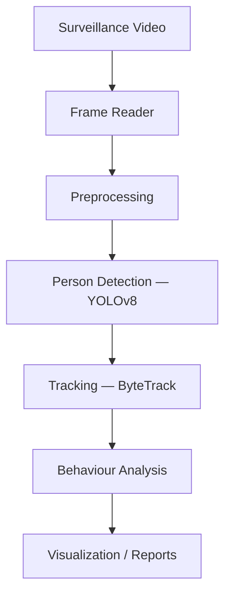
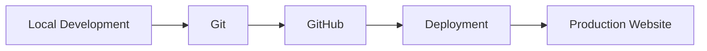

<div align="center">

# Anmol Engineering World

**An interactive engineering portfolio** — how I build, experiment, and grow as a software engineer.

[](https://react.dev)
[](https://www.typescriptlang.org)
[](https://vite.dev)
[](https://tailwindcss.com)
[](https://www.framer.com/motion)

**Live portfolio:** Coming soon  
**Developer:** [Anmol Kathayat](https://github.com/AN-MOL-KAT) · Bangalore, India

`Artificial Intelligence` · `Machine Learning` · `Computer Vision` · `Software Engineering`

[GitHub](https://github.com/AN-MOL-KAT) · [LinkedIn](https://www.linkedin.com/in/anmol-kathayat-41ab63418) · [Email](mailto:anmolkathayat20@gmail.com)

</div>

---

## Overview

**Anmol Engineering World** presents my engineering journey through projects, skills, experimentation, and software work — not as a conventional resume site, but as an **interactive engineering environment**.

The interface pairs a minimal dark visual system with subtle motion, interactive navigation, project exploration, technical timelines, GitHub activity, and engineering-focused content.

> Show how I think, build, experiment, and solve problems through software.

---

## Features

<table>
<tr>
<td width="50%" valign="top">

### Interactive environment
- Dynamic engineering-style background
- Lightweight particle system
- Neural-network-inspired visuals
- Subtle technical grid
- Mouse-reactive interactions
- Performance-conscious canvas rendering

</td>
<td width="50%" valign="top">

### Project Lab
Projects are interactive systems, not static cards. Each can communicate:

Problem · Approach · Technologies · Architecture · Implementation · Results · Status

</td>
</tr>
<tr>
<td width="50%" valign="top">

### Skill Constellation
Skills grouped as engineering categories:

Programming · AI · Machine Learning · Computer Vision · Web · Tools & Technologies

</td>
<td width="50%" valign="top">

### Engineering Journey
A timeline of:

Education · Technical learning · Projects · Research · Experience

</td>
</tr>
<tr>
<td width="50%" valign="top">

### GitHub / Proof of Work
Technical work connected to development activity and contribution history.

</td>
<td width="50%" valign="top">

### Command Center
Keyboard-accessible command interface — navigate the portfolio like an engineering workspace.

</td>
</tr>
</table>

**Responsive** across desktop, laptop, tablet, and mobile.

**Accessible & fast:** reduced-motion support, keyboard-friendly interactions, semantic navigation, focus-visible states, lazy-loaded sections, optimized animation loops, production bundle optimization, and lightweight canvas rendering.

---

## Technology stack

| Technology | Purpose |
| --- | --- |
| **React** | UI architecture |
| **TypeScript** | Type-safe development |
| **Vite** | Development and production builds |
| **Tailwind CSS** | Utility-first styling |
| **Framer Motion** | UI motion and transitions |
| **Lucide React** | Interface icons |
| **HTML5 Canvas** | Interactive background rendering |
| **Git / GitHub** | Version control and collaboration |

---

## Architecture

Modular, component-based structure. Content lives in `src/data/` so projects, skills, and timeline entries can change without rewriting the UI.

<details>
<summary><strong>Repository layout</strong></summary>

```
anmol-engineering-world/
│
├── public/
│   ├── favicon.svg
│   ├── resume.pdf
│   └── robots.txt
│
├── src/
│   ├── components/
│   │   ├── background/     EngineeringBackground, Grid, NeuralNetwork, ParticleField
│   │   ├── command/        CommandCenter
│   │   ├── cursor/         CustomCursor
│   │   ├── hero/           Hero
│   │   ├── navigation/     Navbar, SectionIndicator
│   │   ├── projects/       ProjectLab, ProjectSelector, ProjectDisplay
│   │   ├── skills/         SkillConstellation
│   │   ├── journey/        EngineeringTimeline
│   │   ├── github/         GithubActivity
│   │   ├── about/          About
│   │   └── contact/        Contact
│   │
│   ├── data/               profile.ts · projects.ts · skills.ts · journey.ts
│   ├── hooks/              useMousePosition · useReducedMotion · useScrollProgress
│   ├── lib/                motion.ts · utils.ts
│   ├── App.tsx
│   ├── index.css
│   └── main.tsx
│
├── index.html
├── package.json
├── tsconfig.json
├── vite.config.ts
└── README.md
```

</details>

---

## Design philosophy

The visual language is restrained on purpose. Instead of heavy 3D, large gradients, or decorative animation, the interface uses:

- Dark engineering workspace aesthetics
- Subtle cyan technical accents
- Fine grid structures
- Controlled motion
- Minimal panels
- Monospace technical labels
- Progressive section transitions
- Interactive environmental elements

> **Technology should support the story, not become the story.**

---

## Performance engineering

Performance is part of the implementation, not a last-minute pass.

**Background rendering** — lightweight canvas with device-pixel-ratio limiting, particle-count scaling, visibility detection, `requestAnimationFrame`, mouse interaction bounds, and controlled connection rendering.

**Animation** — interactive components avoid unnecessary continuous React state updates. Mouse-driven motion uses animation-frame throttling where it helps.

**Code splitting** — large sections load with React `lazy` / dynamic imports:

```tsx
const ProjectLab = lazy(() => import("./components/projects/ProjectLab"));
```

The browser loads major sections progressively instead of shipping one large initial bundle.

### Production metrics

Measured during local production testing (hardware, browser, network, and hosting will change these numbers):

| Metric | Result |
| --- | --- |
| Largest Contentful Paint | ~1.66 s |
| Cumulative Layout Shift | 0 |
| Interaction to Next Paint | ~56 ms |
| Initial JavaScript | ~106 KB gzip |
| CSS | ~9.5 KB gzip |

---

## Accessibility

- Semantic HTML
- Keyboard-accessible controls
- `focus-visible` states
- `prefers-reduced-motion` support
- Appropriate interactive element semantics
- Decorative visuals marked as non-essential
- Custom cursor disabled on coarse-pointer devices

```css
@media (prefers-reduced-motion: reduce) {
  /* less animated experience */
}
```

---

## Featured project — NeuroBehaviour-Analysis

An AI-assisted behavioural analysis system that processes surveillance video for behavioural and movement-related signals relevant to neurological research.

**Stack:** Python · OpenCV · YOLOv8 · ByteTrack · MediaPipe · Computer Vision · Machine Learning



Part of a broader neurological analysis system covering behavioural, audio/video, and gait analysis.

---

## Local development

**Prerequisites:** Node.js, npm, Git

```bash
node --version
npm --version
git --version
```

```bash
git clone https://github.com/AN-MOL-KAT/anmol-engineering-world.git
cd anmol-engineering-world
npm install
npm run dev
```

The app is available at the local Vite URL printed in the terminal.

### Production build

```bash
npm run build
npm run preview
```

Output goes to `dist/` (gitignored).

### Scripts

| Command | Description |
| --- | --- |
| `npm run dev` | Start development server |
| `npm run build` | Type-check and create production build |
| `npm run preview` | Preview production build |
| `npm run lint` | Run ESLint |

---

## Deployment

Built for static hosts that support Vite.



Publish the `dist/` folder from `npm run build`.

**Environment variables:** the core portfolio does not need private secrets. If you add any later, keep them in `.env` / `.env.local` and never commit them (already gitignored).

---

## Development principles

| Principle | Meaning |
| --- | --- |
| **Modular** | Components split by responsibility |
| **Data-driven** | Content separate from UI |
| **Performance-conscious** | Animations and rendering respect browser workload |
| **Accessible** | Usable without relying on animation or pointer effects |
| **Maintainable** | New projects, skills, and sections without rewriting the app |
| **Progressive** | Built in phases, each tested before the next |

---

## Roadmap

**Done**

- [x] Project architecture
- [x] Interactive engineering background
- [x] Navigation & hero
- [x] Project Lab
- [x] Skill Constellation
- [x] Engineering Timeline
- [x] GitHub / Proof of Work
- [x] About & Contact
- [x] Command Center
- [x] Motion & interaction layer
- [x] Performance optimization
- [x] Production build
- [x] SEO metadata & robots
- [x] GitHub repository setup

**Next**

- [ ] Production deployment
- [ ] Custom domain
- [ ] Live GitHub activity integration
- [ ] Additional project case studies
- [ ] Continuous portfolio improvements

---

## Author

**Anmol Kathayat**  
Computer Science Engineering student · Cambridge Institute of Technology, Bangalore

B.Tech / B.E. Computer Science Engineering · 2023–2027 · CGPA 7.96

**Focus:** Artificial Intelligence · Machine Learning · Computer Vision · Software Engineering

**Connect:** [GitHub](https://github.com/AN-MOL-KAT) · [LinkedIn](https://www.linkedin.com/in/anmol-kathayat-41ab63418) · [anmolkathayat20@gmail.com](mailto:anmolkathayat20@gmail.com)

---

## License

Personal portfolio and engineering showcase. Source is public for reference and learning. Personal content, branding, resume material, and project-specific assets should not be reused as if they were your own.

---

<div align="center">

**Anmol Engineering World** — the systems I build, the technologies I explore, and the engineer I am becoming.

</div>
